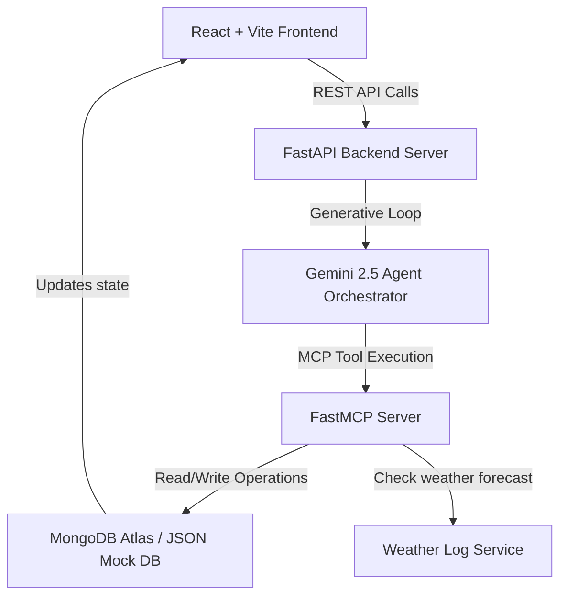

# 🏝️ Bocas del Toro Concierge: Local Experience & Eco-Tourism Coordinator
### MongoDB Track — Google Cloud Rapid Agent Hackathon

Welcome to the **Bocas del Toro Concierge**! This project is an autonomous AI concierge and logistics dispatcher designed for boutique hotels, eco-lodges, and local activity operators in Bocas del Toro, Panama. 

By integrating **Gemini 2.5**, **Model Context Protocol (MCP)**, and **MongoDB**, this agent moves "beyond chat" to actively manage guest itineraries, monitor live weather reports, automatically propose indoor reschedules when storms threaten outdoor bookings, and commit transactions back to MongoDB.

---

## 📸 Project Showcase & Key Features

*   **Warm Afro-Caribbean Persona:** The agent interacts with guests using a warm, hospitable island tone (*"no stress", "Pura vida", "respect"*).
*   **Dual Database Adaptability:** Detects your MongoDB configuration dynamically. If no Atlas URI is provided, it falls back to a high-fidelity, file-backed JSON Mock DB with transaction simulation.
*   **Real-time Weather Dispatcher:** Simulates weather forecasts. If a rainy/stormy forecast affects an outdoor booking, the agent automatically structures a replan proposal.
*   **Human-in-the-Loop Rescheduling:** The agent does not force database writes. It surfaces an **interactive swap proposal card** in the UI chat for the guest to Approve or Decline.
*   **Live MCP Reasoning Log Console:** A scrolling developer panel displays step-by-step logs of the agent's MCP tool calls (e.g., `get_bookings`, `check_weather`, `reschedule_booking`, `generate_itinerary`).
*   **Official printable Travel Receipts:** Displays a live rendering of the official trip itinerary document, formatted in Markdown, which can be printed instantly.

---

## 🏗️ Architecture

The application is split into a **Python FastAPI** backend and a **React + Vite** frontend.



*   **`backend/db.py`**: Handles MongoDB Atlas connections or handles operations using `MockCollection` (supporting dot-notation path updates and nested dictionary modifications).
*   **`backend/mcp_server.py`**: Exposes FastMCP tools (`get_tours`, `get_bookings`, `check_weather`, `reschedule_booking`, `generate_itinerary`).
*   **`backend/agent.py`**: Runs the Gemini generative reasoning loop with system instructions. Implements lazy initialization to avoid boot-time crashes if API keys are missing.
*   **`frontend/src/App.jsx`**: Manages timeline views, chat streams, simulation logs, and handles proposal approvals.
*   **`frontend/src/index.css`**: Renders custom glassmorphic panels and dark ocean styling.

---

## 🚀 Setup & Execution

### 1. Prerequisites
*   **Python 3.12** or higher
*   **Node.js** (v18+) and **npm**
*   **Gemini API Key** (Get one at [Google AI Studio](https://aistudio.google.com/))

---

### 2. Backend Setup

1.  Navigate to the backend directory:
    ```bash
    cd backend
    ```

2.  Copy `.env.example` to `.env`:
    ```bash
    cp .env.example .env
    ```

3.  Configure your environment in `.env`:
    *   `GEMINI_API_KEY`: Paste your Google Gemini API key.
    *   `MONGO_URI` (Optional): To run with a live MongoDB instance, paste your Connection URI here. If left blank, the app runs on the high-fidelity mock fallback out of the box!

4.  Activate the python virtual environment:
    ```bash
    source venv/bin/activate
    ```

5.  Start the FastAPI backend:
    ```bash
    python main.py
    ```
    The server will startup on `http://localhost:8000`.

---

### 3. Frontend Setup

1.  Navigate to the frontend directory:
    ```bash
    cd ../frontend
    ```

2.  Install dependencies:
    ```bash
    npm install
    ```

3.  Run the Vite development server:
    ```bash
    npm run dev
    ```
    Open your browser and navigate to `http://localhost:5173`.

---

## 🕹️ Interactive Simulation Walkthrough

Follow these steps to demonstrate the autonomous agent capabilities:

1.  **Initial View:** Notice that the **🏝️ Stay Schedule Timeline** shows **Alex Mercer** has two outdoor bookings:
    *   *May 30 (Morning):* Cayos Zapatilla Reef Snorkeling (Outdoor, $45)
    *   *May 31 (Afternoon):* Bastimentos Canopy Zip Line (Outdoor, $65)
2.  **Weather Simulation:** In the **⚙️ Operator Control Panel** (bottom right):
    *   Set the date to **May 30, 2026**.
    *   Set the Weather to **Heavy Rain**.
    *   Set the Weather Alert Status to **Rain Warning**.
    *   Click **Trigger Weather Shift**.
3.  **Agent Assessment:**
    *   The database updates to "Heavy Rain" on May 30.
    *   The agent runs an automated inspection, logs the MCP calls in the log console, and reports in the chat: *"Oh my friend, I see we have a storm warning on May 30..."*
    *   It identifies **Green Cacao Chocolate Workshop** (Indoor) as an alternative.
    *   An **interactive proposal card** appears in the chat widget: *"Swap Cayos Zapatilla Snorkeling for Green Cacao Chocolate Workshop"*.
4.  **Confirm Swap:**
    *   Click **Confirm Swap** in the card.
    *   The frontend calls `/api/respond-proposal`, executing the database transactions.
    *   The timeline calendar updates: May 30 now shows the **Green Cacao Chocolate Workshop**.
    *   The **Itinerary Document** updates on the page, showing the Chocolate Workshop and a recalculated total price ($100 instead of $110).
    *   The available slots inside the database are decremented/incremented securely.
5.  **Try Chatting:** Type *"What's on my schedule?"* in the chat box. The agent will inspect MongoDB and give you a warm, updated list of activities!
6.  **Reset:** Click **Reset DB** at any time to return the database to the initial seeded state.

---

## 🏆 Hackathon Compliance & MCP Focus

This application fully conforms to the **MongoDB track** and **MCP Standards**:
1.  **Model Context Protocol (MCP):** The agent performs database transactions and weather reports through formal schemas using Python's `FastMCP` framework.
2.  **Autonomous Operations:** Rather than simple text generation, the agent reads current logistics schedules and writes changes back to MongoDB collections dynamically.
3.  **Human-in-the-Loop:** Safety is integrated through conversational callbacks, validating that LLM planning output passes user confirmation before updating persistent states.
