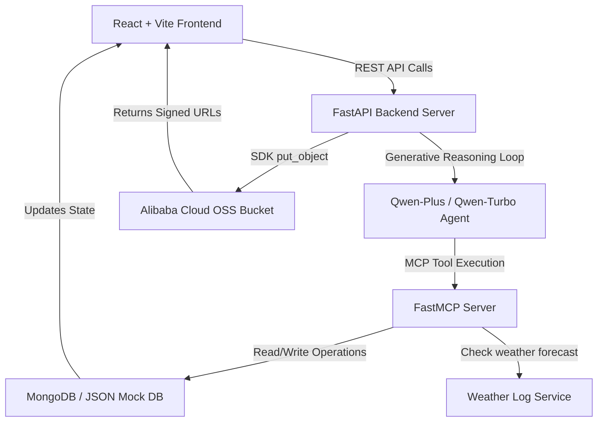

# 🏝️ IslandFlow: Weather-Intelligent Eco-Tourism Concierge & MemoryAgent

### **Track 1: MemoryAgent — Global AI Hackathon Series with Qwen Cloud**

Welcome to **IslandFlow**! This project is an autonomous, weather-intelligent AI concierge and water transit logistics dispatcher designed for boutique hotels, eco-lodges, and local excursion operators in Bocas del Toro, Panama. 

By integrating **Qwen Cloud Models (via DashScope)**, **Model Context Protocol (MCP)**, **MongoDB**, and **Alibaba Cloud Object Storage Service (OSS)**, IslandFlow moves "beyond chat" to actively manage guest itineraries, monitor live marine weather forecasts, automatically upgrade vessel sizes based on ocean swell, and instantly broadcast dispatch warnings to sea captains when schedules change.

---

## 🚀 Key Hackathon Highlights & Track Focus

### **1. Track 1: MemoryAgent — Persistent Cognitive Memory**
To excel in the **MemoryAgent** track, IslandFlow implements a high-performance cross-session persistent cognitive layer:
* **Asynchronous Preference Extraction**: When a guest chats with the concierge (e.g., *"I have a severe peanut allergy"* or *"I hate snorkeling, too crowded"*), the Qwen agent immediately captures this preference and calls the `save_conversational_memory` tool to store it in the `conversational_memories` collection.
* **High-Performance Zero-Shot Context Injection**: For all future conversations and sessions, the guest's profile is loaded, and their persistent memories are injected directly into the Qwen prompt context. The agent immediately personalizes its recommendations, restaurant bookings, and tour proposals without needing redundant tool calls or losing memory on page refreshes.

### **2. Proof of Alibaba Cloud API Usage (OSS Integration)**
To satisfy the official requirement of demonstrating direct usage of Alibaba Cloud services, we have integrated the **Alibaba Cloud Object Storage Service (OSS)**:
* **The Flow**: When a guest's itinerary is finalized, updated, or exported, the backend compiles a beautiful Markdown receipt and uploads it directly to an Alibaba Cloud OSS bucket using the official `oss2` Python SDK.
* **Verification**: The backend returns a signed, secure OSS URL (valid for 24 hours) for the guest to view or download.
* **Code Proof**: The entire implementation is located in [backend/ali_oss.py](file:///Users/dorienvandenabbeele/Downloads/IslandFlow%20-%20Qwen%20Hackathon/backend/ali_oss.py), demonstrating direct interaction with Alibaba Cloud APIs.

### **3. Weather-Intelligent Logistics & Spatial Dispatch**
* **Zero-Transit Spatial Bypass**: No water taxi is dispatched if the tour and hotel reside on the mainland (*Isla Colon*).
* **Wave Action Captain Matching**: Waves between $1.0\text{m}$ and $1.5\text{m}$ trigger an automatic upgrade to a robust `"large"` vessel.
* **Severe Swell Grounding**: Waves $>1.5\text{m}$ block outdoor tours entirely, prompting Qwen to cancel them, alert captains, and recommend local resort-level activities.

---

## 🏗️ Architecture



*   **[backend/ali_oss.py](file:///Users/dorienvandenabbeele/Downloads/IslandFlow%20-%20Qwen%20Hackathon/backend/ali_oss.py)**: Handles direct upload of itineraries to Alibaba Cloud OSS using the `oss2` library, falling back to a Sandbox Simulation Mode if credentials are not configured.
*   **[backend/agent.py](file:///Users/dorienvandenabbeele/Downloads/IslandFlow%20-%20Qwen%20Hackathon/backend/agent.py)**: Houses the system prompts and the main `run_qwen_agent` loop. Features zero-shot memory context pre-fetching.
*   **[backend/mcp_server.py](file:///Users/dorienvandenabbeele/Downloads/IslandFlow%20-%20Qwen%20Hackathon/backend/mcp_server.py)**: Defines FastMCP tools (`get_tours`, `get_bookings`, `check_weather`, `add_booking`, `reschedule_booking`, `generate_itinerary`). Exposes geographical spatial rules and wave height filtering.
*   **[backend/db.py](file:///Users/dorienvandenabbeele/Downloads/IslandFlow%20-%20Qwen%20Hackathon/backend/db.py)**: Establishes a connection to MongoDB Atlas, supporting a local, high-fidelity file-backed JSON Mock DB (`mock_db.json`) fallback on startup.
*   **[frontend/src/App.jsx](file:///Users/dorienvandenabbeele/Downloads/IslandFlow%20-%20Qwen%20Hackathon/frontend/src/App.jsx)**: A stunning, responsive operator dashboard built with dark glassmorphism schemes, housing the **Live Captain Notifications Panel** and a scrolling developer console that displays the agent's live MCP reasoning logs.

---

## 🚀 Setup & Execution

### 1. Prerequisites
* **Python 3.12** or higher
* **Node.js** (v18+) and **npm**
* **DashScope API Key** (or standard OpenAI API key for Qwen)
* **Alibaba Cloud Access Key & Secret** (for OSS uploads)

---

### 2. Backend Setup

1. Navigate to the backend directory:
   ```bash
   cd backend
   ```

2. Copy `.env.example` to `.env`:
   ```bash
   cp .env.example .env
   ```

3. Configure your credentials in `.env`:
   * `LLM_PROVIDER=qwen`
   * `OPENAI_API_BASE`: Choose your API base URL:
     * Standard Free Trial: `https://dashscope-intl.aliyuncs.com/compatible-mode/v1`
     * Token Plan: `https://token-plan.ap-southeast-1.maas.aliyuncs.com/compatible-mode/v1`
   * `DASHSCOPE_API_KEY`: Paste your DashScope/Qwen API key.
   * `QWEN_MODEL=qwen3.7-plus`
   * `ALI_OSS_ACCESS_KEY_ID`: Your Alibaba Cloud Access Key ID.
   * `ALI_OSS_ACCESS_KEY_SECRET`: Your Alibaba Cloud Access Key Secret.
   * `ALI_OSS_ENDPOINT`: Your OSS region endpoint (e.g. `oss-ap-southeast-1.aliyuncs.com`).
   * `ALI_OSS_BUCKET`: Your target OSS bucket name.

4. Start the FastAPI backend:
   ```bash
   venv/bin/python main.py
   ```
   The backend server will spin up on `http://localhost:8000`.

---

### 3. Frontend Setup

1. Navigate to the frontend directory:
   ```bash
   cd ../frontend
   ```

2. Install dependencies:
   ```bash
   npm install
   ```

3. Run the development server:
   ```bash
   npm run dev
   ```
   Open your browser and navigate to `http://localhost:5173`.

---

## 🕹️ Interactive Simulation Walkthrough

Follow these steps to demonstrate IslandFlow's persistent memory and weather-intelligent dispatching capabilities:

1. **Verify Persistent Memory (Track 1)**:
   * Select a guest profile in the UI (e.g., **Alex Mercer**).
   * Open the chat box and type: *"I have a severe allergy to shellfish, make sure to save that!"*
   * The Qwen agent will call `save_conversational_memory` behind the scenes.
   * Look at the **Guest Persistent Memories** dashboard widget on the page. It will automatically update in real-time, displaying: *"severe allergy to shellfish"*.
   * Refresh the page or change profiles and switch back; the memory is fully persistent!

2. **Trigger Weather Shift**:
   * Change the date to **May 30, 2026** in the operator panel.
   * Set the Weather to **Heavy Rain** and Wave Height to **1.8m** (danger threshold).
   * Click **Trigger Weather Shift**.

3. **Observe Autonomous Planning**:
   * Qwen detects that Alex has an outdoor snorkeling booking on May 30th.
   * Since waves exceed $1.5\text{m}$, the agent blocks the tour and automatically looks up Alex's hotel local activities (from the `tenants` DB collection).
   * Qwen alerts the guest and presents an interactive **Schedule Proposal Card** in the chat, proposing a safe on-site activity (e.g., *Green Cacao Chocolate Workshop*).

4. **Confirm Proposal & Watch Live Dispatch Broadcasting**:
   * Click **Confirm Swap** inside the chat proposal card.
   * The backend registers the changes, cancels the transit dispatch, and **instantly broadcasts** a cancellation warning to the captain.
   * Switch to Sub-Tab 2 (**Dispatch Ledger**) in the dashboard. You will see a flashing **Live Captain Notifications** glass panel showing an active, real-time warning broadcast: *"🚨 NOTIFICACIÓN INMEDIATA: Capitán ... su traslado ha sido CANCELADO."*

5. **Export to Alibaba Cloud OSS**:
   * Click the **Export to Alibaba Cloud OSS** button.
   * The backend compiles a Markdown travel receipt, uploads it natively to Alibaba Cloud OSS, and returns a secure, signed public download URL.

---

## 🏆 Judging Criteria Alignment

* **Innovation & AI Creativity (30%)**: Dual-purpose use of Qwen as a conversational memory agent and logical dispatcher utilizing real-time Model Context Protocol (MCP) tooling.
* **Technical Depth & Engineering (30%)**: Extremely clean, modular Python/React code, featuring native Alibaba Cloud OSS SDK integration and a dynamic Mongo DB / Mock DB transaction system.
* **Problem Value & Impact (25%)**: Addresses critical logistical pain points in tropical marine transport, increasing safety for both guests and sea captains.
* **Presentation & Documentation (15%)**: Comprehensive step-by-step interactive walkthrough, fully documented architecture diagram, and explicit links to integration code proofs.

---

## ☁️ Alibaba Cloud Deployment (Devpost Proof)

To satisfy the mandatory Devpost requirement of **Proof of Deployment on Alibaba Cloud** (including the screenshot of running resources from your Alibaba Cloud Workbench):
1. Refer to the detailed **[submission_guide.md](.agents/../submission_guide.md)** or checkout the `/submission_guide.md` file in this repository.
2. It contains step-by-step instructions on spinning up an **Alibaba Cloud Elastic Compute Service (ECS)** instance, deploying the IslandFlow Docker containers, and capturing the specific **Workbench Console** screenshot required for your submission.

---

