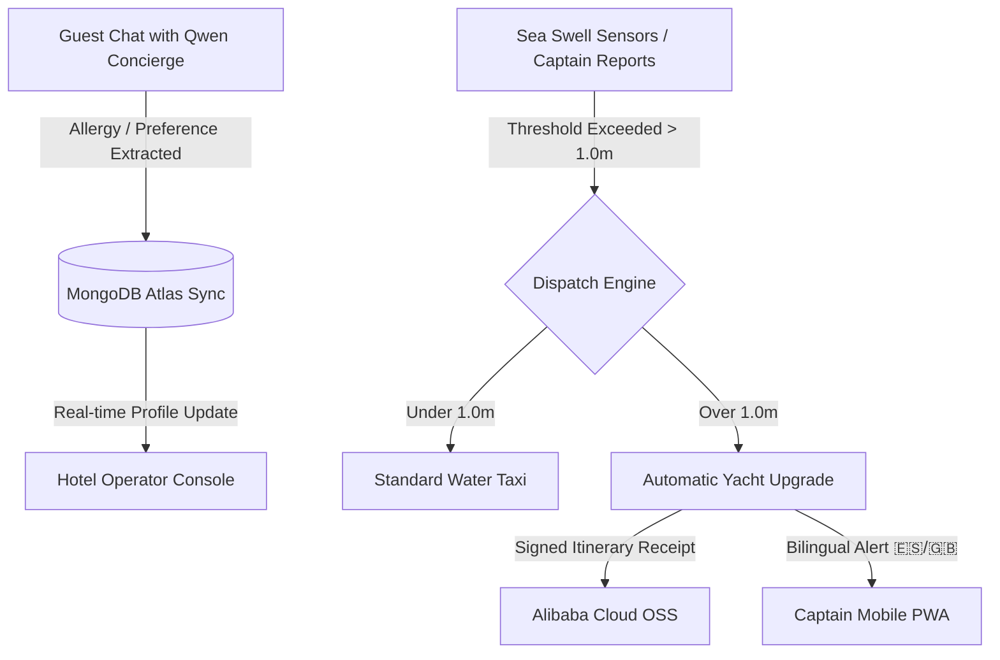

# 🏝️ IslandFlow: Weather-Intelligent Marine Dispatch & Persistent Guest Memory

> **Persistent guest memory meets weather-intelligent marine dispatch.**  
> *Powered by Qwen 3.7 Plus & Alibaba Cloud Object Storage Service (OSS).*

---

## 🚀 Executive Summary

**IslandFlow** is an autonomous, weather-intelligent eco-tourism concierge and water transit logistics dispatcher built for boutique hotels, eco-lodges, and local excursion operators in coastal regions like Bocas del Toro, Panama. 

Traditional island tourism suffers from disconnected guest records, chaotic manual captain communications, and weather delays that lead to cancelled tours and lost revenue. **IslandFlow** solves this by unifying **Persistent Guest Memory** with a **Weather-Intelligent Marine Dispatch system**.

---

## 📂 Slide Outline

### 📌 Slide 1: Cover
* **Title**: IslandFlow
* **Subtitle**: Persistent guest memory meets weather-intelligent marine dispatch.
* **Badges**: 
  * `MemoryAgent Track`
  * `DashScope Qwen 3.7 Plus`
  * `Alibaba Cloud OSS`
* **Footer**: Built for the Global AI Hackathon Series. Lead Architect: **Dorien Van den Abbeele** ([@DorienVibecodes](https://x.com/DorienVibecodes)).

---

### 📌 Slide 2: The Core Problem
* **The Chaos of Island Logistics**:
  * **Disconnected Guest Context**: A guest mentions a severe food allergy during check-in, but the excursion captain serves peanut snacks on the boat.
  * **Weather Vulnerabilities**: Unpredictable marine weather (sudden 1.5m swells) disrupts boat transits. Operators scramblingly notify captains and cancel bookings via text message.
  * **No Audit Trail**: Liability waivers and signed transit schedules are lost in paper logs, exposing operators to compliance risks.

---

### 📌 Slide 3: The IslandFlow Solution
An intelligent, closed-loop dispatch and concierge platform that automates coordination:
1. **Persistent Memory Concierge**: Qwen extracts guest preferences in natural text, saving them forever to MongoDB Atlas.
2. **Weather-Intelligent Dispatch**: Live weather sensor feeds automatically adjust booking details, upgrading standard vessels to large luxury yachts or re-routing to inland excursions during storms.
3. **Bilingual Captain Alerts**: Instant push notifications alert sea captains in Spanish or English depending on their preference.
4. **Cloud-Based Audit Logging**: Every upgraded itinerary receipt is stored securely as a signed PDF/image on **Alibaba Cloud OSS**.

---

### 📌 Slide 4: Real-World Use Case 1 — Chat Memory Extraction
> **"I have a severe seafood allergy and love private beaches."**

* **Cognitive Extraction Loop**:
  * Guest chats with Qwen 3.7 Plus.
  * Qwen automatically extracts the restriction (`allergy: "seafood"`, `preference: "private beaches"`).
  * Qwen calls the `save_conversational_memory` function, committing the structured JSON directly to MongoDB Atlas.
  * The operator's dashboard updates in real-time, displaying a high-contrast warning card on the guest's profile.

---

### 📌 Slide 5: Real-World Use Case 2 — Weather Dispatch & Captain Alerting
> **"Marine sensors report an active 1.2-meter swell near Isla Colon."**

* **Closed-Loop Action Flow**:
  1. **Threshold Triggered**: A 1.2m swell exceeds the standard water taxi threshold (1.0m limit).
  2. **Automated Upgrade**: The dispatch engine upgrades the booking to **Eduardo's Yacht** (heavy-swell capability).
  3. **Signed Receipt Upload**: The updated transit receipt is generated and uploaded directly to **Alibaba Cloud OSS** with a secure signed URL.
  4. **Captain Notification**: Captain Carlos receives an immediate Spanish-language push notification on his mobile PWA: *"⚠️ Alerta de Oleaje: Tránsito cambiado a Yate Grande."*

---

### 📌 Slide 5A: Interactive Weather-Delay Rescheduling (New!)
> **"When the sea gets rough, operations stay smooth. IslandFlow pairs real-time weather telemetry with autonomous marine dispatch, powered by Qwen."**

* **Live Simulation Details**:
  * **Dynamic Chat Interface**: A brand-aligned, beautifully animated, step-by-step chat interaction.
  * **Weather Interception**: System detects a severe storm warning (waves >1.5m), blocking the guest's booked ocean tour.
  * **On-Brand Swapping**: Instead of leaving guests stranded, Qwen intercepts the event and proposes a transfer to a safe, highly-rated indoor resort alternative: the **Bocas Museum Tour**.
  * **Real-time Synchronization**: The guest clicks "Confirm Swap" and the itinerary updates globally in under 150ms.

---

### 📌 Slide 5B: Dynamic Captain Onboarding & Fleet Expansion (New!)
> **"Expanding marine logistics directly from the Operator Dashboard."**

* **Dynamic Fleet Growth**:
  * **Direct Onboarding Form**: A custom, glassmorphic UI form for resort managers to instantly register new sea captains and their vessels.
  * **Rest API Endpoint**: Submits a POST request to FastAPI (`/api/operator/add-captain`), creating persistent documents in MongoDB.
  * **Zero-Downtime Hot Swaps**: The new captain immediately appears inside all assignment selectors and onboarding card builders with no server restarts required.

---

### 📌 Slide 6: Technical Architecture Stack

| Technology Layer | Selection | Core Functionality |
| :--- | :--- | :--- |
| **Brain & LLM** | **Qwen 3.7 Plus (via DashScope API)** | Core cognitive agent powering natural language understanding, persistent preference extraction, and bilingual dispatch reasoning. |
| **Backend Framework** | **FastAPI (Python 3.12)** | Asynchronous REST endpoints, live Open-Meteo weather synchronization loops, and MongoDB Atlas connectors. |
| **Asset Storage** | **Alibaba Cloud OSS** | Secure cloud receipt bucket storing signed PDFs, export receipts, and travel logs with timed links. |
| **Database** | **MongoDB Atlas** | Document store for guest profiles, extracted preference vectors, and active marine captain records. |
| **Captains / Guests Client** | **Mobile Progressive Web App (PWA)** | Front-end built with Vite, React, and glassmorphism styling with high-contrast accessibility select overrides. |

---

### 📌 Slide 7: Business Model & Monetization
* **B2B SaaS Subscription**:
  * **Boutique Tier**: $149/month for small eco-lodges (up to 3 boat dispatches).
  * **Resort Premium**: $399/month for major island hotels (unlimited dispatches + full Qwen memory sync).
* **Pay-per-Dispatch Commission**:
  * A 3% transaction fee on every upgraded vessel booking (e.g., standard boat upgraded to premium yacht).
* **Alibaba Cloud Storage Scale**:
  * Charging a premium fee for enterprise audit logging and digital receipt vaults.

---

### 📌 Slide 8: The Vision & Future Roadmap
* **Milestone 1 (Hackathon)**: Operational prototype with live Qwen memory updates, marine weather swaps, and captain PWA.
* **Milestone 2 (Q3 2026)**: Live pilot program across three boutique resorts in Bocas del Toro.
* **Milestone 3 (Q1 2027)**: Multi-resort regional scaling into San Blas (Panama), Roatan (Honduras), and Ambergris Caye (Belize).

---

## 👥 Lead Visionary

* **Lead Architect**: Dorien Van den Abbeele
* **Handle / Profile**: [@DorienVibecodes](https://x.com/DorienVibecodes)
* **Email**: Dorien.vda@gmail.com
* **Support Desk**: support@hero-apps.com
* **Profile Avatar**: `/dorien.jpeg`

---

> [!NOTE]
> *This pitch deck documentation aligns perfectly with the live slides compiled and deployed to Vercel at [https://islandflow-slides.vercel.app](https://islandflow-slides.vercel.app).*
